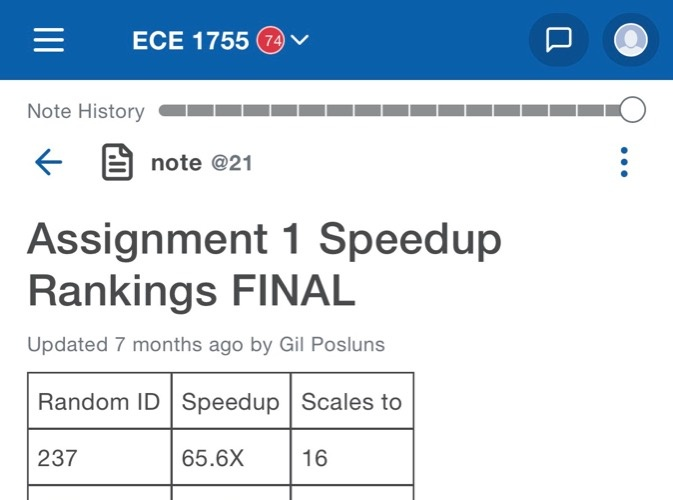
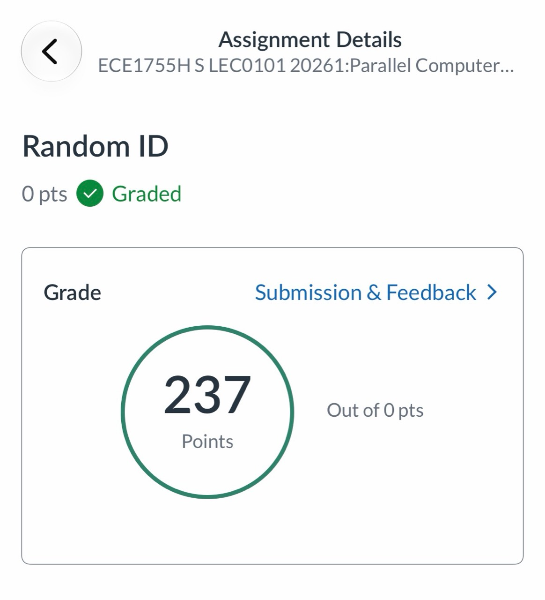

# ECE1755 Assignment 1: Parallel Beamforming

This assignment optimizes a 3D ultrasound beamformer in C using pthreads, AVX2/AVX-512 SIMD, cache-aware blocking, loop unrolling, aligned memory, and CPU affinity.

## Final speedup ranking

The Winter 2026 ECE1755 final Assignment 1 leaderboard lists Random ID **237** first with a **65.6x speedup** at 16 threads. The assignment feedback page associates this submission with Random ID **237**.

Together, the screenshots document first place in the Assignment 1 speedup ranking; they do not represent an overall course-grade ranking.
